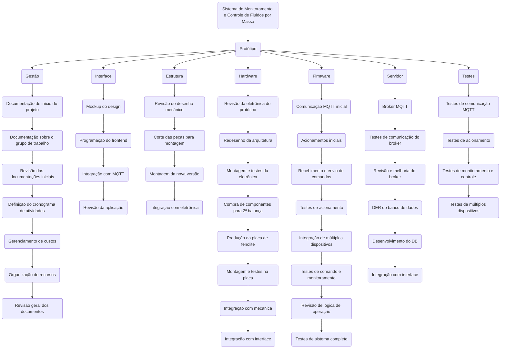

```mermaid
graph TD;
    A(Sistema de Monitoramento e Controle de Fluidos por Massa)
    A1(Protótipo)

    B(Gestão)
    B1(Documentação de início do projeto)
    B2(Documentação sobre o grupo de trabalho)
    B3(Revisão das documentações iniciais)
    B4(Definição do cronograma de atividades)
    B5(Gerenciamento de custos)
    B6(Organização de recursos)
    B7(Revisão geral dos documentos)

    C(Interface)
    C1(Mockup do design)
    C2(Programação do frontend)
    C3(Integração com MQTT)
    C4(Revisão da aplicação)

    D(Estrutura)
    D1(Revisão do desenho mecânico)
    D2(Corte das peças para montagem)
    D3(Montagem da nova versão)
    D4(Integração com eletrônica)

    E(Hardware)
    E1(Revisão da eletrônica do protótipo)
    E2(Redesenho da arquitetura)
    E3(Montagem e testes da eletrônica)
    E4(Compra de componentes para 2ª balança)
    E5(Produção da placa de fenolite)
    E6(Montagem e testes na placa)
    E7(Integração com mecânica)
    E8(Integração com interface)

    F(Firmware)
    F1(Comunicação MQTT inicial)
    F2(Acionamentos iniciais)
    F3(Recebimento e envio de comandos)
    F4(Testes de acionamento)
    F5(Integração de múltiplos dispositivos)
    F6(Testes de comando e monitoramento)
    F7(Revisão de lógica de operação)
    F8(Testes de sistema completo)

    G(Servidor)
    G1(Broker MQTT)
    G2(Testes de comunicação do broker)
    G3(Revisão e melhoria do broker)
    G4(DER do banco de dados)
    G5(Desenvolvimento do DB)
    G6(Integração com interface)

    H(Testes)
    H1(Testes de comunicação MQTT)
    H2(Testes de acionamento)
    H3(Testes de monitoramento e controle)
    H4(Testes de múltiplos dispositivos)

    A --> A1

    A1 --> B
    A1 --> C
    A1 --> D
    A1 --> E
    A1 --> F
    A1 --> G
    A1 --> H

    B --> B1
    B1 --> B2
    B2 --> B3
    B3 --> B4
    B4 --> B5
    B5 --> B6
    B6 --> B7

    C --> C1
    C1 --> C2
    C2 --> C3
    C3 --> C4

    D --> D1
    D1 --> D2
    D2 --> D3
    D3 --> D4

    E --> E1
    E1 --> E2
    E2 --> E3
    E3 --> E4
    E4 --> E5
    E5 --> E6
    E6 --> E7
    E7 --> E8
    
    F --> F1
    F1 --> F2
    F2 --> F3
    F3 --> F4
    F4 --> F5
    F5 --> F6
    F6 --> F7
    F7 --> F8

    G --> G1
    G1 --> G2
    G2 --> G3
    G3 --> G4
    G4 --> G5
    G5 --> G6

    H --> H1
    H1 --> H2
    H2 --> H3
    H3 --> H4
```
